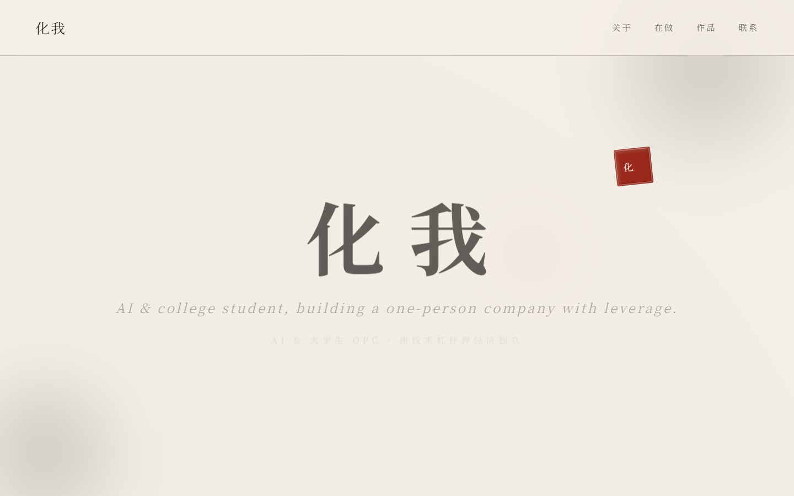
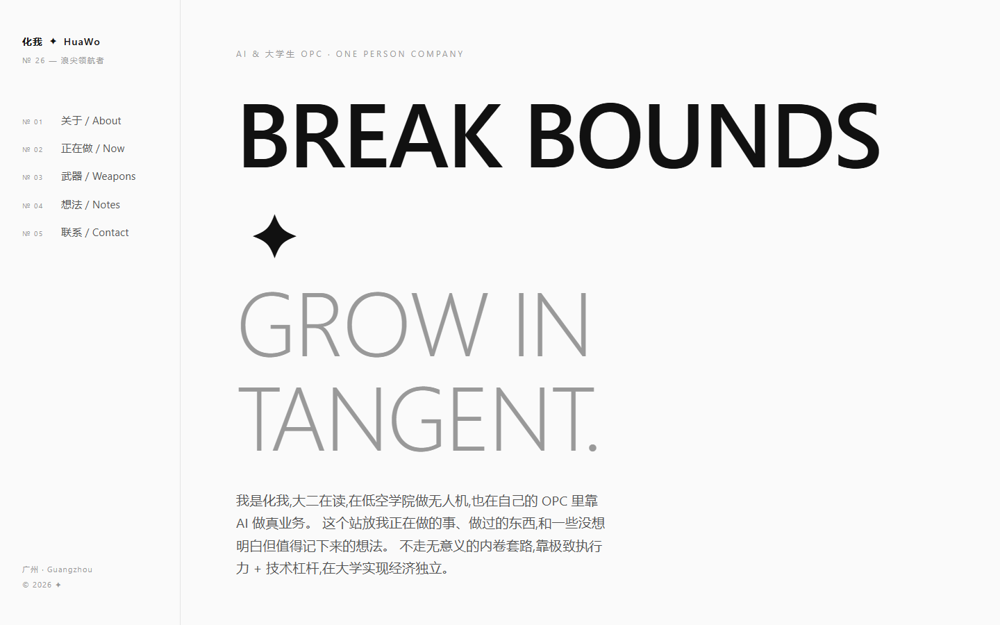
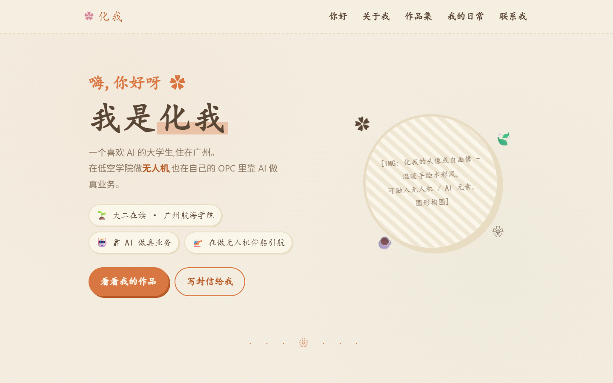
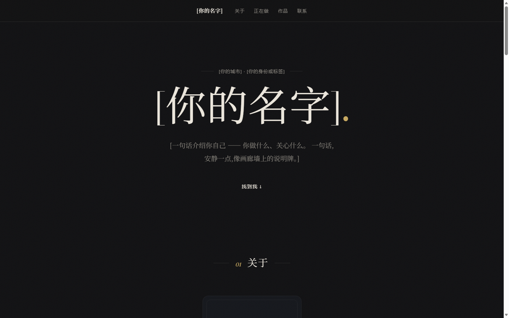
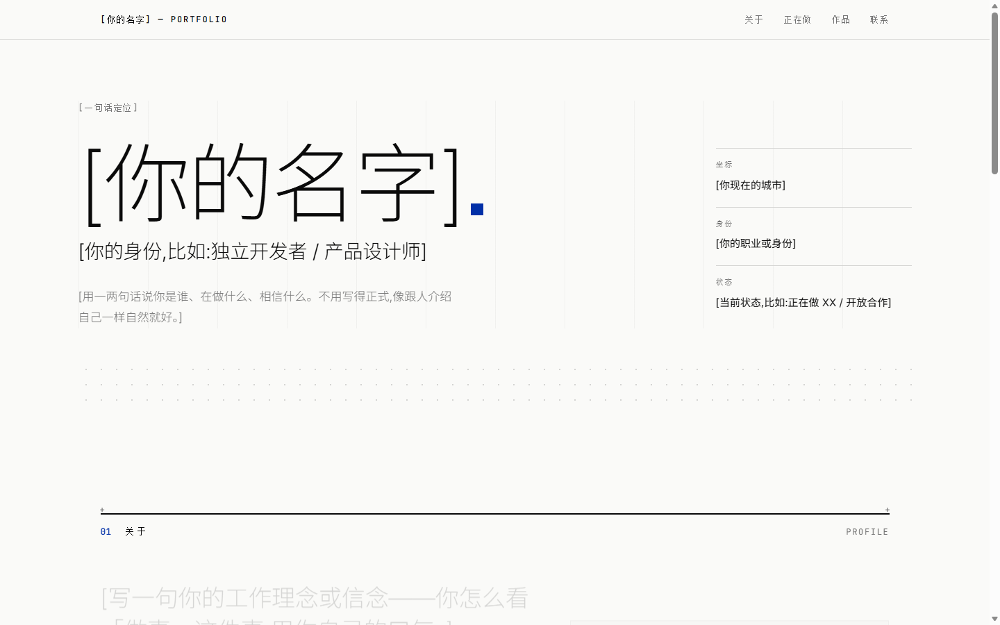
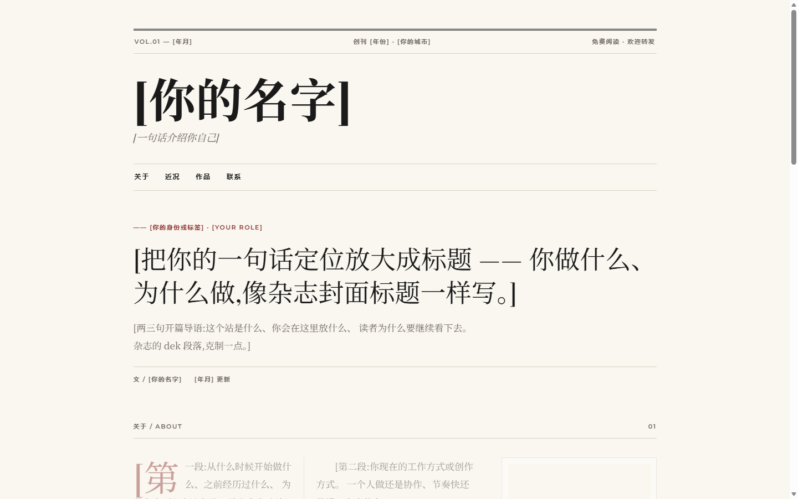
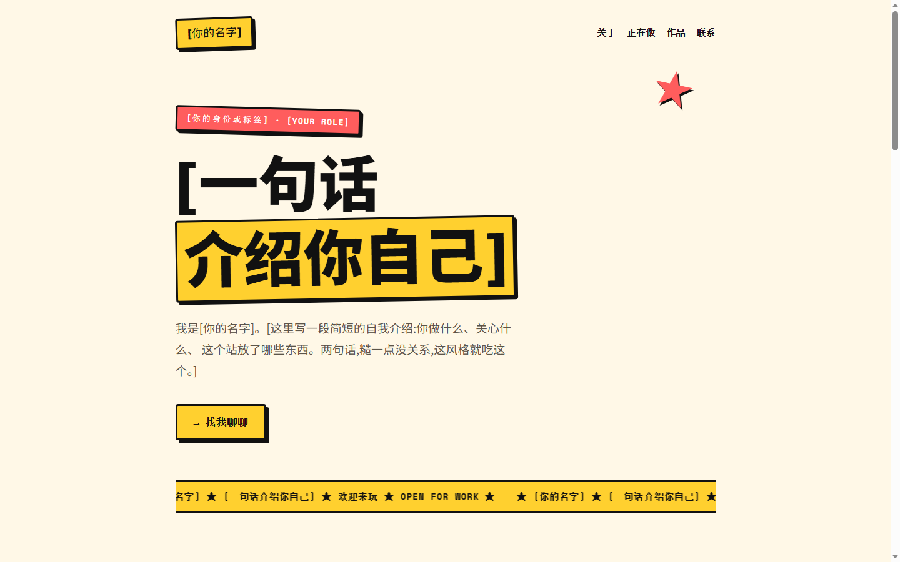

# HuaWo Website Skill · 个人网站填充助手

> 一个 Claude Skill,帮你做个人介绍网站。
> 你不用懂代码,只要跟 AI 对话回答几个问题,AI 自动帮你把信息填进模板,交付完整可用的网站。

[](LICENSE)
[](https://github.com/topics/claude-skill)
[](README.md)
[](README.en.md)

---

## ✨ 这个 Skill 能做什么

你跟 AI 说「帮我做个个人网站」,AI 会:

1. 帮你**选风格**(七种风格,水墨/极简/温暖手作/暗色高级/瑞士国际/杂志编辑/新粗野)
2. **对话式问你**几个问题(名字、定位、作品、联系方式)
3. **自动把信息填进 HTML 模板**
4. 给你一个**完整可用的网站文件**,双击就能用浏览器打开

整个过程**不用碰一行代码**。

---

## 🎨 七种风格

下面截图都是**用这个 skill 的模板直接渲染的网站**(示例用户:化我,大二学生做 OPC)。挑一个最贴近你想要的感觉的风格。

### 水墨安静风 · 适合喜欢东方美学、传统文化的人



中国水墨 + 书法 + 印章 + 留白。气质克制、安静、有记忆点。

---

### 极简现代风 · 适合开发者、设计师、写作者



黑白灰 + 大量留白 + 左侧目录式导航。克制、有质感、像设计师作品集。

---

### 温暖手作风 · 适合插画师、手作人、生活博主



米色暖橙 + 手写感 + 和纸胶带 + 纸张质感。柔和、有手感、生活气息浓。

---

### 暗色高级风 · 适合独立开发者、设计师、摄影师



近黑深底 + 衬线大字 + 居中画廊式排版 + 一点金色 + 相纸噪点,进场像布展一样逐件淡入。安静、贵气、作品说话,像一场个人展览。晚上看特别舒服。

---

### 瑞士国际风 · 适合工程师、产品经理、技术人设



无衬线超细大标题 + 克莱因蓝 + 非对称网格拼贴 + 十字准星 + 网格线露出,进场是小距离精确上升。像瑞士平面设计海报(Helvetica / Vignelli),理性、克制、信息至上。

---

### 杂志编辑风 · 适合写作者、内容创作者



报头 + 期号 + 双细线 + 首字下沉 + 栏线 + 跨栏拉引语 + 文末尾花,进场是油墨显影式淡入。像一份个人日报,把「关于我」写成头版。

---

### 新粗野风 · 适合年轻创作者、独立艺术家



奶油底 + 粗黑边框 + 硬阴影 + 黄红撞色 + 跑马灯 + 星星贴纸。大声、直接、有态度,过了几年看也不过时。

---

每种风格都是**纯 HTML + CSS 单文件**,无 React、无 Next.js、无任何依赖。双击就能跑。

---

## 🚀 30 秒上手

### 安装

一条命令搞定:

```bash
npx skills add https://github.com/leo485610395-cmyk/huawo-website-skill --skill huawo-website-skill
```

或者直接把这个仓库 clone 到 skills 目录:

```bash
cd ~/.claude/skills/
git clone https://github.com/leo485610395-cmyk/huawo-website-skill.git
```

### 使用

装完后,在你的 AI 工具里(Claude Code / Cursor / Codex 等)说一句:

```
帮我做个个人网站
```

AI 会自己调用这个 skill,通过对话问你:
1. **想做什么风格**(七种风格,说不清就告诉它你是做什么的,它帮你挑)
2. **你是谁**(名字、定位、作品、联系方式)
3. **填不出来的它启发式问你**(给选项、给例子)

聊完 AI 自动把信息填进 HTML 模板,给你一个完整能用的网站文件,双击就能用浏览器打开。

**整个过程不用碰代码。**

---

## 💡 设计哲学

这个 skill 跟市面上其他「AI 网站生成器」不一样:

| 别人做的 | 我们做的 |
|---|---|
| 动画重、组件库向(React + Framer Motion) | **克制不炫技,内容比形式重要** |
| 开发者向(要懂 React/Next.js) | **小白向**(用记事本都能改) |
| 单一专业风 | **7 种风格:水墨/极简/温暖手作/暗色高级/瑞士国际/杂志编辑/新粗野** |
| 英文 | **中文优先** |
| 只给方法论 | **直接给模板 + 方法论配套** |

核心心法(来自[教程](https://tcnprzcql6xt.feishu.cn/docx/VifCdjesVoJUONxI0XocFWlbnyg)):

> **心法 1**:找到好的对标网站
> **心法 2**:让 AI 复制它

---

## 📁 项目结构

```
huawo-website-skill/
├── SKILL.md                      # 主入口(AI 读这个)
├── README.md                     # 你正在看的
├── LICENSE                       # MIT
├── CONTRIBUTING.md               # 贡献指南
├── assets/                       # 网站模板
│   ├── 01-水墨安静风.html
│   ├── 02-极简现代风.html
│   ├── 04-温暖手作风.html
│   ├── 05-暗色高级风.html
│   ├── 06-瑞士国际风.html
│   ├── 07-杂志编辑风.html
│   ├── 08-新粗野风.html
│   └── showcase/                 # 各风格效果图
├── references/                   # 详细参考
│   ├── info-checklist.md         # 各风格信息收集清单
│   ├── quality-checklist.md      # 交付前质量检查表
│   └── deployment-guide.md       # 部署上线指南
└── scripts/
    └── check-quality.py          # 自动质量检查脚本
```

---

## 🔧 高级用法

### 自己加新风格

想加一个「赛博朋克风」?在 `assets/` 里加一个 HTML 模板(占位符用 `[xxx]` 格式),然后在 `SKILL.md` 和 `references/info-checklist.md` 里加对应的说明。

### 用质量检查脚本

交付前用脚本快速检查:

```bash
python scripts/check-quality.py 生成的网站.html --template assets/02-极简现代风.html
```

脚本会检查:占位符是否全替换、CSS 是否被破坏、基本结构是否完整。

### 部署上线

做完的网站想让别人访问,看 [`references/deployment-guide.md`](references/deployment-guide.md)。
推荐用 Netlify,30 秒搞定。

---

## 📚 配套教程

这个 skill 是「一个人做个人网站」教程的配套工具。

**完整教程**:https://tcnprzcql6xt.feishu.cn/docx/VifCdjesVoJUONxI0XocFWlbnyg

教程里讲了完整的两心法 + 4 场景 prompt,适合想理解原理、做自己的版本的人。skill 是给「不想学,直接用」的人。

---

## 🤝 贡献

欢迎贡献新风格模板、新语言翻译、bug 修复。

看 [CONTRIBUTING.md](CONTRIBUTING.md) 了解怎么做。

---

## 📝 License

MIT License - 你可以自由使用、修改、分发,只要保留版权声明。

---

## 👤 作者

**化我** · https://huawo.netlify.app

一个在大学做 OPC(一人公司)的人,正在用 AI 做真业务。

- 个人网站:https://huawo.netlify.app
- GitHub:[leo485610395-cmyk](https://github.com/leo485610395-cmyk)
- 完整教程:https://tcnprzcql6xt.feishu.cn/docx/VifCdjesVoJUONxI0XocFWlbnyg

如果这个 skill 帮到你,欢迎 star ⭐
